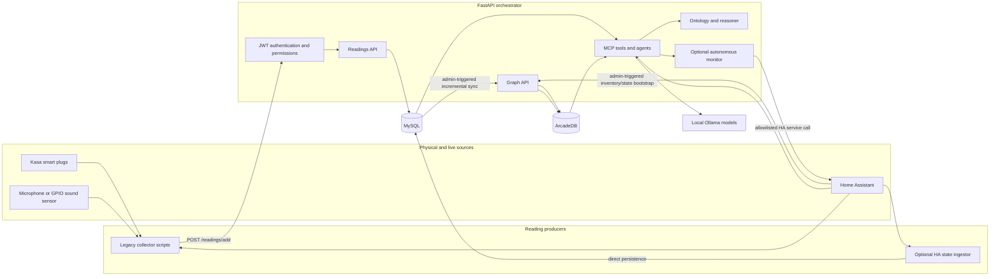
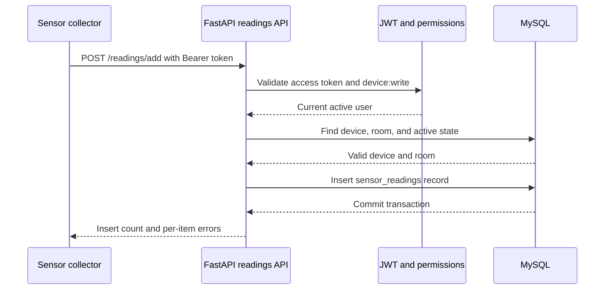
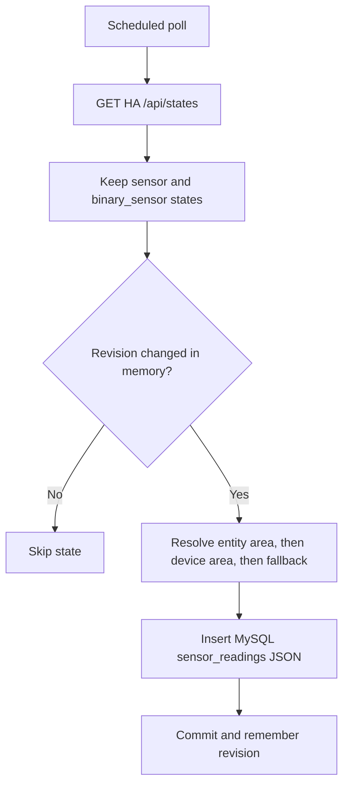
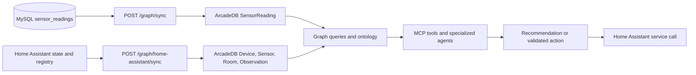
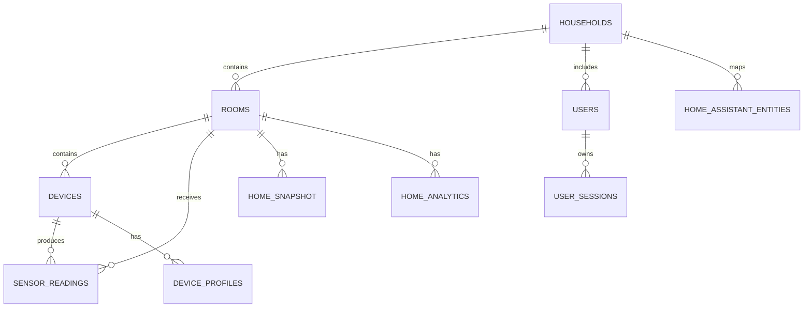

# EcoNest architecture and data flow

## Purpose and current shape

EcoNest is a smart-home monitoring and automation project. It records sensor
data, maintains home/device context, and can use that context in graph queries,
rule/ontology checks, agent tasks, and Home Assistant actions.

The current application is the FastAPI **orchestrator**. It supersedes the
older standalone Flask backend and ML-oriented scripts, although a few legacy
sensor collectors can still post compatible data to the orchestrator.

## System architecture

### Source-of-truth boundaries

| Concern | System of record | Notes |
| --- | --- | --- |
| Live device state and service calls | Home Assistant | EcoNest queries HA and can issue validated actions; it does not replace HA. |
| Raw EcoNest readings and relational inventory | MySQL | `sensor_readings`, `devices`, `rooms`, households, users, analytics, snapshots, and audit events live here. |
| Relationship context and reasoning topology | ArcadeDB | Graph data is populated through explicit sync/bootstrap operations. |
| LLM inference | Ollama | Uses the configured primary model with fallback behavior. It is not a data store. |

## Main ingestion paths

### Authenticated collector submission

The main programmatic ingestion API is `POST /readings/add` in
`orchestrator/api/readings.py`. It accepts one reading or a batch. The caller
must present an access JWT for a role with `device:write`; the intended collector
identity is a `service_account` token. The API resolves the room from the stored
device record and writes the database timestamp itself.

Invalid, inactive, or roomless devices are rejected for that item. An all-failed
batch rolls back and returns `400`; a partially valid batch commits valid rows
and returns the rejected items in `errors`.

### Optional Home Assistant state polling

`HomeAssistantIngestor` polls HA's `/api/states` endpoint when
`HA_INGEST_ENABLED=true`. This is disabled by default in `config.py`, but enabled
by default in `docker-compose.real.yml`. It selects `sensor.*` and
`binary_sensor.*` entities whose HA state is neither `unknown` nor `unavailable`.
Within one process lifetime it stores only changed revisions, persisting directly
to MySQL rather than using the authenticated readings API.

The poller refreshes the HA area/device/entity registry every five minutes.
Each HA area is mirrored to MySQL `rooms` by `household_id` and `ha_area_id`, and
each entity is recorded in `home_assistant_entities` for traceability. A reading
uses its direct entity area, then its parent device area, otherwise the fallback
room named `Home Assistant` (`ha_area_id=home_assistant`). If registry access is
temporarily unavailable, known devices retain their current MySQL room.

Historical HA readings are intentionally unchanged during ordinary operation.
Use `python scripts/sync_ha_rooms.py --dry-run` to preview reassignment and
`python scripts/sync_ha_rooms.py --apply` during a planned, stopped-orchestrator
cutover. The migration changes only `room_id` fields; it does not delete or
replace reading IDs, timestamps, JSON payloads, or device IDs.

## From readings to graph, agents, and actions

MySQL-to-ArcadeDB propagation is **not automatic**. A superadmin explicitly
calls `POST /graph/sync`; it upserts MySQL rooms/devices and maps readings to
`SensorReading` graph vertices since the requested `last_sync` timestamp. A
separate `POST /graph/home-assistant/sync` bootstraps HA inventory/current states
straight into ArcadeDB, including devices, sensors, rooms, observations, and
relationships. It should not be assumed to reconcile all MySQL inventory.

### Verified live state — 2026-08-14

Read-only checks against the currently running `econest-real` environment show
that these two paths are in different states:

| Check | Observed result | Conclusion |
| --- | --- | --- |
| HA ingestor status | enabled, running, 73 successful runs, 4,083 inserted readings | The HA-to-MySQL ingestion path is active. |
| MySQL `sensor_readings` | 21,826 rows after the HA-area migration; 0 reading/device room mismatches | Raw readings are persisted to MySQL and now use registry-backed rooms. |
| MySQL consistency | 0 reading/device room mismatches | Stored readings currently agree with their devices' rooms. |
| ArcadeDB `SensorReading` | 0 vertices | MySQL readings are **not** currently being synchronized into the graph. |
| ArcadeDB context | 402 Devices, 19 Rooms, 224 Sensors, 402 Observations | HA graph inventory/current-state context has been populated. |
| ArcadeDB MySQL-linked records | 0 Devices and 0 Rooms with `mysql_id` | The relational graph-sync path has not populated this graph instance. |

In short: **MySQL is the active raw-reading destination; ArcadeDB currently
contains HA-derived relationship/context data, not the raw EcoNest reading
history.** A graph sync must be intentionally run and then verified before any
documentation or feature treats ArcadeDB `SensorReading` data as available.

MCP tools centralize MySQL reads, graph queries, HA state reads, and supported
device actions. The agent orchestrator routes work to energy, security, sensor,
or device agents. The autonomous monitor is optional; actions are separately
controlled through allowlist and confidence settings.

## Data model at a glance

Important graph equivalents are `Room`, `Device`, `SensorReading`, `Sensor`,
and `Observation`, linked by edges such as `LOCATED_IN`, `MONITORS`, and
`OBSERVED_IN`. The complete ArcadeDB schema is in `arcade_schema.sql`.

## Runtime and operations notes

- `docker-compose.yml` starts MySQL, ArcadeDB, Ollama, and the orchestrator;
  HA is external. `docker-compose.real.yml` is the local live-demo variant.
- `/health` reports MySQL and ArcadeDB reachability. `/ingestion/status` and
  `/autonomy/status` expose background-service status.
- `POST /ingestion/run-once`, graph sync/bootstrap, device actions, and
  autonomy operations can mutate state. Do not use them for read-only auditing.
- Scripts under `Machine_learning/` are no longer part of the current runtime.
  Their schema assumptions must not be used as the current data contract.
- The working tree may contain local, uncommitted configuration/ingestion
  changes. Inspect `git status` before treating this guide as a release record.
