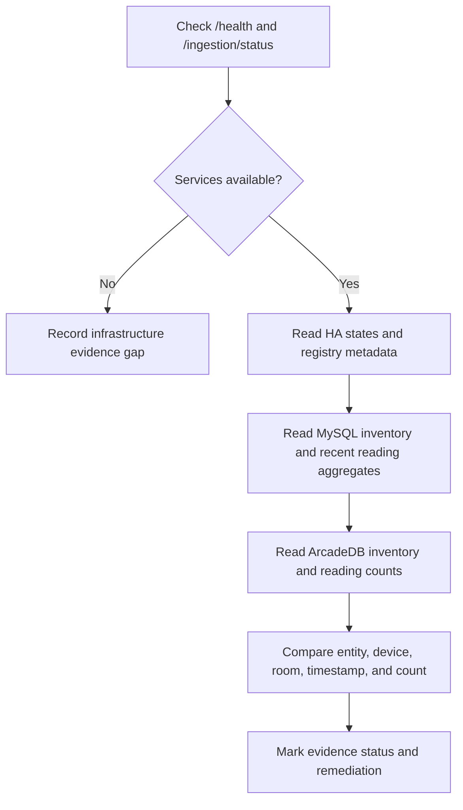

# Sensor data contract and integrity verification

## Canonical reading contract

The current API accepts either one object or a JSON array of these objects:

```json
{
  "device_id": 28,
  "data": {
    "sound_level": 42.0,
    "spike": false
  }
}
```

`device_id` must identify an active `devices` row with a non-null `room_id`.
`data` must be a non-empty JSON object. The API does not accept a producer
timestamp: MySQL supplies `sensor_readings.timestamp` at insert time.

Common producer payloads currently found in the repository are:

| Signal | Expected JSON keys | Typical unit/meaning |
| --- | --- | --- |
| Power | `power`, optionally `voltage`, `current`, `total_kwh` | W, V, A, kWh |
| Sound | `sound_level`, optionally `spike` | dB and boolean threshold result |
| Motion | `motion` | boolean |
| HA state poller | `state`, `attributes`, `last_changed`, `last_updated`, `source` | HA-native state snapshot; `source` is `home_assistant` |

The schema deliberately keeps `data` flexible JSON. Consumers must therefore
validate the keys, types, units, and semantic meaning required for their own
signal rather than assume every record has the same fields.

## Storage and graph mapping

| Stage | Required identity | Stored representation | Verification focus |
| --- | --- | --- | --- |
| API submission | authenticated active user and valid `device_id` | `sensor_readings(device_id, room_id, timestamp, data)` in MySQL | API response, commit, room derives from device |
| HA polling | HA `entity_id` | device `ha_entity_id`, registry-backed MySQL room, and HA snapshot JSON | state filtering, duplicate/change behavior, entity → device → area mapping |
| Relational graph sync | MySQL IDs and sync watermark | ArcadeDB `Room`, `Device`, `SensorReading` | row count, IDs, timestamp, JSON map conversion |
| HA graph bootstrap | HA entity/device/area registry relationship | ArcadeDB inventory and `Observation` vertices | room/device mapping and current-state freshness |

## Verification procedure

Use this procedure to determine what is demonstrably working. Record every
result as **verified**, **partially verified**, **not verified**, or
**incompatible**. Never place credentials, HA states, IP addresses, or raw
private readings in committed evidence.

### 1. Static contract review

- Inventory every enabled producer and destination environment variable.
- Compare payload keys with the downstream consumer that uses them.
- Compare every SQL read/write against `database_schema.txt` and every graph
  upsert against `arcade_schema.sql`.
- Trace scheduled behavior: HA polling starts only when enabled; graph sync is
  an admin request; legacy analytics/ML jobs are not orchestrator jobs.

### 2. Isolated-stack verification

- Start the test stack defined by `docker-compose.yml` plus
  `docker-compose.test.yml`; use the repository's test/demo commands.
- Run `poetry run poe test` and `poetry run poe lint` in the orchestrator
  container or supported local environment.
- Exercise mocked or isolated authenticated ingestion with valid, invalid,
  inactive, roomless, empty, and mixed batches. Confirm transaction and error
  semantics.
- Treat this as implementation coverage, not evidence that real hardware or HA
  data is configured correctly.

### 3. Live read-only verification

Use read-only credentials and capture aggregate/count-based evidence only.



Read-only checks should establish:

- The orchestrator can reach MySQL and ArcadeDB; HA polling status aligns with
  its configured setting.
- Recent readings belong to active devices and their recorded room matches the
  current device room.
- Reading JSON is valid, non-empty, and has expected key/type/unit patterns by
  device class; timestamps are fresh and consistently interpreted as database
  time.
- HA entity → device → area → room mappings are complete where expected.
- MySQL `rooms.ha_area_id` matches HA's current areas plus `home_assistant`;
  HA-derived historical readings match their device room after the explicit
  `sync_ha_rooms.py --apply` migration.
- ArcadeDB graph records reconcile with the selected MySQL sync watermark and
  HA bootstrap time. Missing data is expected until an explicit sync has run.

Do not call `/ingestion/run-once`, `/graph/sync`,
`/graph/home-assistant/sync`, device-action endpoints, or autonomy run endpoints
as part of a read-only audit: each can write records or affect the home.

## Required reconciliation queries

Run equivalents appropriate to the deployed database roles. They are examples,
not commands to paste against an unknown production database.

```sql
-- Detect readings whose stored room no longer matches the device's room.
SELECT sr.id, sr.device_id, sr.room_id AS reading_room_id, d.room_id AS device_room_id
FROM sensor_readings AS sr
JOIN devices AS d ON d.id = sr.device_id
WHERE sr.room_id <> d.room_id;

-- Summarize current data freshness without exposing payload content.
SELECT d.id, d.name, d.device_type, COUNT(*) AS reading_count,
       MAX(sr.timestamp) AS latest_reading
FROM devices AS d
LEFT JOIN sensor_readings AS sr ON sr.device_id = d.id
GROUP BY d.id, d.name, d.device_type
ORDER BY latest_reading DESC;

-- Find unmapped HA-linked devices.
SELECT id, name, ha_entity_id, room_id
FROM devices
WHERE ha_entity_id IS NOT NULL AND room_id IS NULL;
```

For ArcadeDB, compare `SensorReading.mysql_id` to MySQL
`sensor_readings.id`, and compare graph `Device.mysql_id` or `ha_entity_id` to
the relevant relational/HA identity. Record counts and a small redacted sample
rather than exporting home inventory.

## Known compatibility risks to verify first

| Finding | Impact |
| --- | --- |
| Graph synchronization is manually triggered. | MySQL and ArcadeDB can legitimately be out of date with each other. |
| HA polling suppresses unchanged states only in process memory. | Restarting the service may reinsert current states. |
| The current schema's `devices.device_type` enum differs from legacy `energy`, `motion`, and `sound` expectations. | Legacy analytics or device seed data may not run or may silently miss records. |
| Legacy ML scripts expect snapshot anomaly fields not present in the tracked `home_snapshot` schema. | They are not valid evidence of current runtime behavior. |
| The readings API sets ingestion time itself. | Sensor capture time cannot be reconstructed unless included inside `data`. |

## Current live evidence — 2026-08-14

The read-only inspection documented in the architecture guide has established
the current local live-demo state: HA polling is actively inserting readings
into MySQL, while the ArcadeDB graph has HA inventory/context records but no
`SensorReading` records and no MySQL-linked `Device` or `Room` records. Mark the
MySQL ingestion flow **verified** and the MySQL-to-ArcadeDB reading-sync flow
**not verified / currently absent** until an authorized graph sync is run and a
fresh reconciliation confirms its results.

## Evidence report template

| Flow | Expected result | Evidence source | Status | Follow-up |
| --- | --- | --- | --- | --- |
| Collector → `/readings/add` → MySQL | Accepted records persist with correct device/room | API result and aggregate query |  |  |
| HA poller → MySQL | Only eligible HA sensor states are stored | status plus aggregate query |  |  |
| MySQL → ArcadeDB | Synced records retain identifiers and timestamps | cross-store count/ID comparison |  |  |
| HA → ArcadeDB bootstrap | Device/area/context records appear as expected | redacted inventory reconciliation |  |  |
| Agent/HA action | Permissions and allowlists protect actions | code/tests only unless explicitly authorized |  |  |
